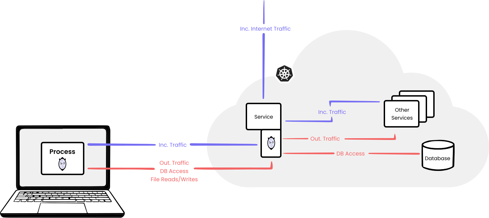
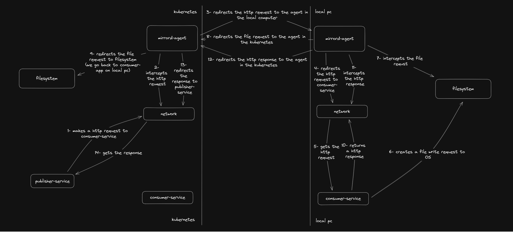
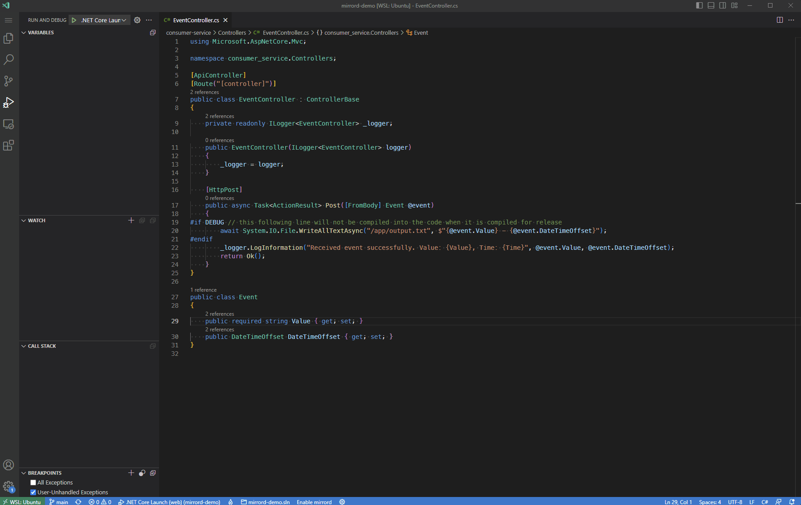

+++
date = "2022-05-16"
title = "Let's debug a kubernetes pod locally"
description = "No one can deny that debugging helps us a lot while solving problems. One major developer experience issue today with kubernetes is that it is hard to debug a problem. Today, we will play with a specific tool that will help us do that"
categories = ["Programming"]
series = ["Developer Experience"]
tags = ["Kubernetes", "Mirrord", "Debug", "Dotnet"]
authors = ["Ahmet Enes Bayraktar"]
lastmod = "2022-05-16"
+++

Today we are going to level up your developer experience on kubernetes.

# Problem

Let's make a quick reality check. You wanted to test something on an already established environment like dev-kubernetes environment without going through the deployment hassle but while having this idea with couple of "Can I do this" questions you faced with the reality that:

1. You simply can not and decided to use something like `docker-compose` to replicate everything you need in your local pc
2. It is already too much to configure everything. So, you might as well deploy. While deployment is in progress, grab a coffee or get a fresh air or both
3. You can roll with the punches so you went through configuring everything (`port-forwarding`, `ingress` etc.)

## Problems with case 1
- Your local pc does not have the resources to deploy everything you need
- You might need to replicate the data as well
- You might be consuming third party resources and they can not send data to you

## Problems with case 2
Nothing wrong with having pauses instead it will help you stay healthy. However, sometimes;
  - You might be in a tight deadline
  - You might not be able solve the problem in your first try, well most of the time :), so you will waste too much time waiting for deployment

## Problems with case 3
- Some services are not web apis. They do not interact with outer world. For example, a worker service consumes message from `rabbitmq` and publishes a new message
- `port-forwarding` is unreliable/not-stable. It might stuck. It will not reconnect on pod restart etc.
- In case you managed configuring everything, it probably took your a lot of your time and you might need to this every other time. Also, you might be okay with too many mouse clicks and too many keyboard presses but don't forget time is a finite resource.

# The Solution

After laying the problem, let's jump into the solution [mirrord](https://github.com/metalbear-co/mirrord/)

Mirrord helps you debug on your local pc while letting you interact with other services inside the kubernetes.

Let me explain the concept briefly by shamelessly copying the image from mirrord



There are 2 mirrord parts. One is in your local pc which wraps your process with a `layer`, and the other is an `agent` pod in Kubernetes. The `agent` in the kubernetes actively intercepts every incoming request to your app(Service in the image) and redirects to the `layer` in your local pc. The `layer` in your local pc also actively intercepts outgoing request from your local app and redirects it to the `agent` in the kubernetes. As far as my tests go, for incoming requests `mirrord` can intercept any request as long as it is TCP(UDP is not supported, yet), be it postgresql query, amqp connection, http(s) request, websocket etc. For outgoing requests both TCP and file requests are supported.

# Demo

In this section I am going to debug an application on my local computer. If you want to follow along you should meet the following prerequisites:

⚠️ `mirrord` does not support Windows. If you want to follow along on Windows, you can use WSL which I will be using. If you think Windows should be supported thumbs up on [this issue](https://github.com/metalbear-co/mirrord/issues/28)

-  The code from [mirrord-demo repository](https://github.com/aeb-dev/mirrord-demo). The files you should care are:

```text
├───.mirrord
│       mirrord.json
│
├───consumer-service
│   ├───Controllers
│   │       EventController.cs
│
├───kubernetes
│       consumer-service.yaml
│       kustomization.yaml
│       publisher-service.yaml
│
└───publisher-service
    │   Worker.cs
```

- The applications are written with dotnet but you should be able to understand it since the applications are fairly straightforward. You can install [dotnet-sdk from here](https://dotnet.microsoft.com/en-us/download/dotnet/thank-you/sdk-7.0.203-windows-x64-installer)

- VS Code and C# and mirrord extensions for debugging. You can install VS Code from [its website](https://code.visualstudio.com/download). You can install extensions from the VS Code Extensions view. You can use any other IDE/Editor of your choice that [mirrord supports](https://github.com/metalbear-co/mirrord/#getting-started)

- `docker`, `kind` and `kubectl` for kubernetes.  You can install [docker from here](https://docs.docker.com/engine/install/), [kind from here](https://kind.sigs.k8s.io/docs/user/quick-start/#installation) and [kubectl from here](https://kubernetes.io/docs/tasks/tools/). Kindly(pun intended) create your kind cluster

## Almost There

Before we begin let me explain what you should except from the demo.

- We will have two applications. One is called `consumer-service` and the other is called `publisher-service`.
- `publisher-service` sends an event to the `consumer-service` every 10 secs with a timestamp
- `consumer-service` gets the event, logs the values and returns Ok
- These two applications will be deployed to kubernetes and we will observe that they work.
- We will make a change on `consumer-service` and debug that change on our local computer without making a deployment. This change will write the content of the event to `output.txt`
- We will observe the result in the kubernetes.

Here is a drawing for the flow:



## Let's go!

- Open up the `mirrord-demo` repo inside VS Code and focus on terminal
- I already created images both for `consumer-service` and `publisher-service`. Also, inside `kubernetes` folder we have the `yaml` files to deploy. We only need run the following command on the terminal: `kubectl apply -f kubernetes`. This can take some time since kubernetes will pull the images from docker registry.
  - ⚠️ If you already have configurations for other clusters don't forget to change your current `kubectl context`. You can change it with the following command: `kubectl config use-context kind-kind`
  - If you want to create your own images you can run the following command in the application folder `dotnet publish -c Release --os linux --arch x64 /t:PublishContainer` and push the image to a registry. Also do not forget to update the `yaml` files under kubernetes folder with your images
- After the pods are ready. Let's make sure that everything is fine by checking logs. Run the following command with your pod name to tail logs `kubectl logs --follow consumer-service-684cc9b7d6-l2sd7`. You should see stream of logs similar to this `Received event successfully. Value: Hello from the other side, Time: 05/09/2023 22:30:25 +00:00`
- Next, let's check that there is no `output.txt`. Run the following command with your pod name: `kubectl exec -it consumer-service-684cc9b7d6-l2sd7 -- bash -c "cat output.txt"`. You should have and output similar to the following: `cat: output.txt: No such file or directory`.
- Now, let's debug our application on local machine with `mirrord`

  

  Once the debugger starts you can check that the pod stopped logging. The reason for that is inside `mirrord.json` we configured mirrord to work on steal mode. This means that, mirrord will not create a copy of the request, instead it will steal and redirect it you.

  At this point, on VS Code debug console you should be seeing the same logs you saw on the pod. If you run this command again `kubectl exec -it consumer-service-684cc9b7d6-l2sd7 -- bash -c "cat output.txt"`, you should see something similar to this: `Hello from the other side - 05/10/2023 19:33:18 +00:00`

  If you want to make sure you are really getting the request you can put a breakpoint on `line 20` inside `EventController.cs`

# Conclusion

That's the end of our debugging session. I have tried to show a simple case that you can get an idea of `mirrord` and its use cases. You could be asking what is next? Well, `mirrord` team is preparing some other useful features you might like. For example:
- Instead of creating a pod to debug, `mirrord-agent` will create a empty container for intercepting requests
- Instead of selecting a pod you will be able select `deployments` or `services`.

I am very excited to see how `mirrord` will play out in the future. What do you think about `mirrord`? If you have any questions or feedback you are very welcomed to comment below! See you on the next post!
